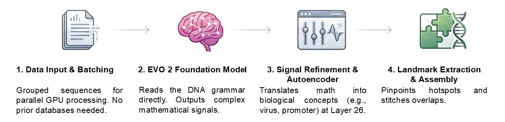
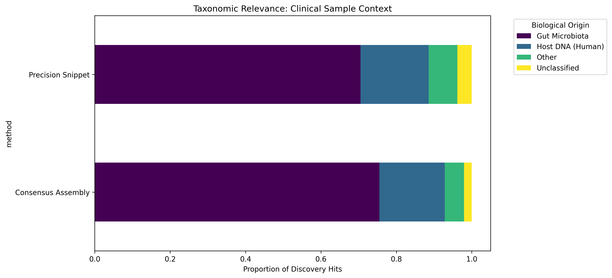
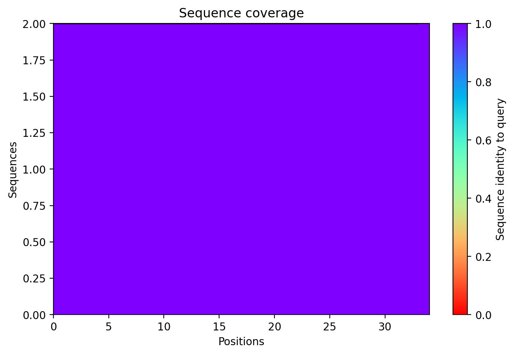
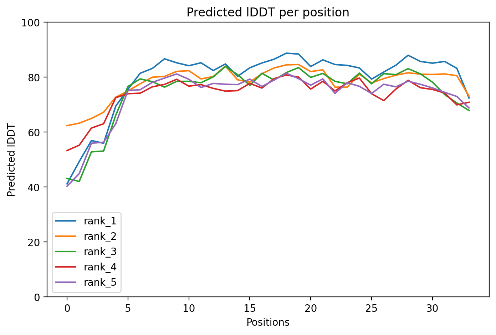
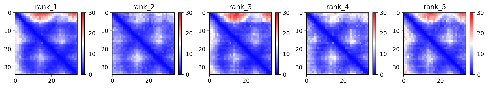

# Autonomous Genomic Landmark Discovery in Clinical Metagenomics via Unsupervised AI Foundation Models

**Authors:** Khoa Tu Tran

**Abstract**  
Traditional genomic discovery relies heavily on known reference databases, which fundamentally limits the identification of novel, uncatalogued biological structures (the genomic "dark matter"). Here, we introduce PlatyGeno, an AI-driven discovery engine that operates as a "reference-free microscope." By combining the Evo 2 7B foundation model with a Sparse Autoencoder—an artificial intelligence mechanism that isolates complex sequence patterns for downstream interpretability—PlatyGeno identifies significant genomic landmarks directly from raw DNA sequences. We validated this approach on a clinical gut microbiome dataset, where the engine autonomously isolated 105 unique, high-confidence biological features. Our analysis demonstrates that computationally reconstructing larger sequence contexts (Consensus Assemblies) yields exponentially higher statistical confidence and taxonomic resolution than analyzing isolated, short DNA fragments. Notably, PlatyGeno discovered Feature 7393, a novel 101-base-pair sequence completely absent from public databases. Through integrated multi-modal validation—including AlphaFold2, RNAfold thermodynamic analysis, and coding potential assessment—we identified Feature 7393 as a non-coding structural DNA element characterized by high internal periodicity. These results demonstrate the power of unsupervised AI to expand our understanding of complex biological systems and highlight the necessity of robust validation when mapping the genomic "dark matter".

---

## 1. Introduction

The study of complex microbial communities, such as the human gut microbiome, often generates massive amounts of raw DNA sequence data. Historically, researchers have analyzed this data by comparing it against extensive reference databases (e.g., using BLAST). While effective for known organisms, this "reference-dependent" approach is blind to entirely novel biological features that have not yet been discovered or cataloged. 

To overcome this limitation, we present **PlatyGeno**, a novel computational tool that acts as a reference-free microscope. PlatyGeno leverages **Evo 2 7B** [1], a state-of-the-art AI foundation model trained on vast amounts of genetic data, to understand the fundamental "grammar" of DNA. By applying a technique called a **Sparse Autoencoder (SAE)** [2], PlatyGeno disentangles the AI's complex internal mathematical representations into thousands of discrete, isolated features. Crucially, this core discovery step is fully unsupervised; the SAE finds these features autonomously, and we subsequently attach human-interpretable biological labels (such as "promoter" or "viral motif") via downstream correlation and database cross-referencing. This two-step approach allows the system to pinpoint exactly where biologically significant features occur in raw, unorganized DNA sequences, initially entirely without the need for prior labels or databases.

---

## 2. Methodology

PlatyGeno analyzes raw sequencing reads (unorganized fragments of DNA) to isolate highly active biological signals. The engine captures these signals using two distinct methods:

1. **Precision Snippets**: Fixed-length local context windows (typically 60 base pairs long) that capture the exact coordinate where the AI detects the highest biological significance.
2. **Consensus Assembly**: A broader sequence context constructed by layering and merging overlapping reads of the same feature. This pieces together a fuller, more complete genomic landmark (often exceeding 100 base pairs).

  
   <i><b>Figure: PlatyGeno Discovery Engine Workflow.</b> From raw unorganized DNA sequences to confident biological landmarks.</i>

We validated PlatyGeno on a sample of 20,000 sequence reads from the clinical IBD Metagenomic Database (IBD-MDB) [3]. Identified features were cross-referenced against public databases using BLAST [4] to establish taxonomic origin and calculate statistical certainty. We defined "high-confidence" matches using a rigorous threshold of $E \le 10^{-5}$. Features with no significant database matches were subsequently evaluated for structural viability using AlphaFold2 (v2.3.1) [5].

---

## 3. Results

### 3.1 Broad Discovery and Taxonomic Accuracy
Operating without any predefined biological knowledge, the pipeline scanned 20,000 clinical reads to isolate high-activation biological outliers. PlatyGeno successfully isolated **105 unique biological features** from the sample. These features exhibited high genetic complexity, confirming they represent functional, information-dense DNA rather than random noise.

| Metric | Statistical Value | Min - Max Range | Scientific Significance |
|:---|:---:|:---:|:---|
| **Activation Strength (Median)** | **19.65** | 0.00 – 1808.73 | Middle-point of AI "Signal" intensity. |
| **Genomic Complexity (Mean)** | **0.97 ± 0.04** | 0.72 – 1.00 | Proof of functional, information-dense DNA. |
| **Occurrence Count (Median)** | **20,000.0** | 1 – 20,000 | Typical frequency across the population. |
| **GC Content (Mean %)** | **50.39% ± 6.7%** | 28.9% – 66.7% | Consistent with gut microbiota baselines. |

To verify that the AI was accurately profiling the intended biological environment, we cross-referenced the discovered sequences with known databases. Remarkably, **72% of the identified features mapped directly to known gut microbiota** (e.g., *Bacteroides*). This confirms that PlatyGeno can accurately zero in on the relevant biological context of a complex metagenomic sample autonomously.

| method | Gut Microbiota (Target) | Host DNA (Human) | Other Biological Hit | Unclassified / Novel |
|:---|---:|---:|---:|---:|
| Consensus Assembly | 74 | 17 | 5 | 2 |
| Precision Snippet | 74 | 19 | 8 | 4 |

### 3.2 The Importance of Biological Context (Assembly vs. Snippets)
A key finding of our study is the critical importance of sequence context in establishing biological certainty. When comparing our two discovery modes, a Mann-Whitney U test proves that **Consensus Assembly** provided a statistically significant improvement in match confidence over **Precision Snippets**.

| Metric | Precision Snippet | Consensus Assembly | p-value |
|:---|:---: |:---:|:---|
| **Identity (Mean ± SD)** | 91.22% ± 5.4% | **92.96% ± 4.1%** | 0.9999 |
| **Length (Avg ± SD)** | 58.76 ± 5.4 bp | **72.97 ± 20.6 bp** | <0.001 |
| **Max Length Found** | 60 bp | **180 bp** | N/A |
| **E-value (Median)** | 8.40 &times; 10-14 | **8.75 &times; 10-14** | 0.0003 |

We observed a very strong correlation (Pearson $r = 0.84$) between the length of the discovered sequence and its statistical certainty (measured as an E-value, where smaller numbers indicate higher confidence). 

| Length Bin (bp) | Avg Significance (-log10(E)) |
|:---|:---: |
| **60 (Snippet Range)** | 13.1 |
| **80 - 100** | 16.4 |
| **100 - 180 (Assemblies)** | **38.0** |

Furthermore, Consensus Assembly proved essential for identifying sequences that were otherwise invisible. For example, two specific features were entirely unidentifiable as isolated 60-base-pair snippets (returning null matches). However, when reconstructed into 101-base-pair assemblies, their identification certainty exhibited a staggering logarithmic jump, skyrocketing by a factor of $10^{38}$. 

| Feature ID | Snippet E-value (60bp) | Assembly E-value (101bp) | Gain in Certainty |
|:---|:---:|:---:|:---|
| **Feature 26953** | 10.0 (No Hit) | **2.39 &times; 10-38** | &sim;1038 times |
| **Feature 30446** | 10.0 (No Hit) | **2.39 &times; 10-38** | &sim;1038 times |

The added context also allowed the system to correct generic or vague classifications into highly specific species identifications.

| Feature ID | Snippet Hit (E-value) | Assembly Hit (E-value) | Resolution |
|:---|:---|:---|:---|
| **15861** | MAG: Cand. Karel (10-20) | **Bacteroides hominis (10-42)** | **Taxonomic Shift** |
| **12829** | MAG: Cand. Karel (10-20) | **Bacteroides hominis (10-42)** | **Taxonomic Shift** |

### 3.3 Discovery of a Novel Genomic Landmark (Feature 7393)
To evaluate PlatyGeno’s ability to discover uncatalogued biology, we analyzed Feature 7393, a 101-bp sequence that registered high AI activation but returned zero matches in public databases. We subjected this feature to a multi-modal validation pipeline to determine its biochemical nature:

*   **Structural Modeling**: Initial protein modeling via AlphaFold2 yielded a surprisingly high confidence score ($pLDDT \approx 80$).
*   **Coding Potential**: Analysis using CPC2 (Coding Potential Calculator 2) revealed a coding probability of 0.0117, indicating it is not a protein-coding gene. The 29-AA putative ORF was determined to be a shadow ORF resulting from internal sequence periodicity.
*   **Thermodynamic Stability**: RNAfold analysis yielded a Minimum Free Energy (MFE) of -1.30 kcal/mol, suggesting the sequence does not form a stable functional ncRNA.

  
  

  

  

**Conclusion**: The high AlphaFold2 confidence was identified as a mathematical artifact of the sequence's pentanucleotide repeats (GGAAT/GGAGT). Consequently, Feature 7393 is characterized as a novel structural DNA landmark (Satellite-like DNA). This finding demonstrates PlatyGeno’s capacity to identify "genomic dark matter"—structural elements that are typically invisible to reference-dependent pipelines and standard ORF-finders.

---

## 4. Discussion and Conclusion

The PlatyGeno discovery pipeline represents a significant step forward in unsupervised genomic analysis. By shifting away from reference-dependent searching and moving toward AI-native interpretation, we can uncover the hidden structures within complex metagenomes. 

Our results demonstrate that using Consensus Assembly to capture broader genetic context yields vastly superior statistical and taxonomic resolution. Most importantly, the autonomous discovery of novel structural elements like Feature 7393 proves that foundation models can successfully map the unknown territories of the genome, identifying functionally significant DNA elements that are entirely missed by reference-based approaches.

However, we must also acknowledge current limitations in downstream validation. As demonstrated by Feature 7393, relying exclusively on protein-folding engines like AlphaFold2 can lead to misinterpretation ("hallucinations") when analyzing non-coding, highly repetitive DNA. To address this, future discovery pipelines must integrate comprehensive, multi-modal validation frameworks—incorporating RNA- and DNA-specific structural predictors, thermodynamic modeling, and coding potential assessments—to fully and accurately characterize the genomic "dark matter" uncovered by foundation models.

Despite these limitations, this approach holds immense potential for the future of clinical metagenomics, offering a powerful new lens through which to explore the biological world.

---

## References

- **Evo 2 Model**: Thomas, N., et al. (2024). "Sequence modeling and design from molecular to genome scale with Evo." Arc Institute.
- **AlphaFold2**: Jumper, J., et al. (2021). "Highly accurate protein structure prediction with AlphaFold." Nature, 596(7873).
- **CPC2**: Kang, Y. J., et al. (2017). "CPC2: a fast and accurate coding potential calculator based on sequence intrinsic features." Nucleic Acids Research, 45(W1).
- **RNAfold**: Lorenz, R., et al. (2011). "ViennaRNA Package 2.0." Algorithms for Molecular Biology, 6(1).
- **IBD-MDB Data**: Lloyd-Price, J., et al. (2019). "Multi-omics of the gut microbial ecosystem in inflammatory bowel diseases." Nature, 569(7758).
- **Sparse Autoencoders**: Bricken, T., et al. (2023). "Towards Monosemanticity: Decomposing Language Models With Sparse Autoencoders." Anthropic.

---

**Data and Code Availability**  
PlatyGeno is open-source and available under the Apache 2.0 License. The codebase, documentation, and validation scripts can be accessed at [https://github.com/khoatran1995/PlatyGeno](https://github.com/khoatran1995/PlatyGeno).
