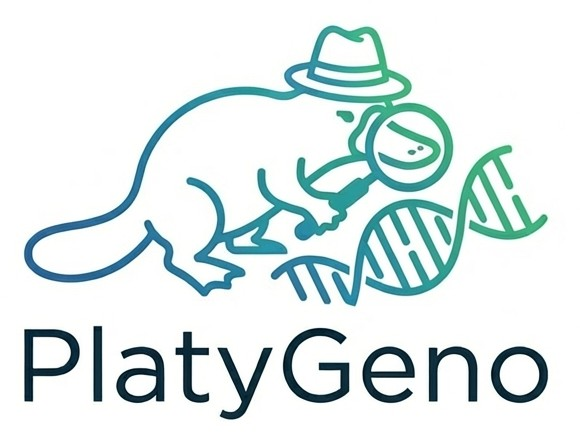

<table width="100%">
  <tr>
    <td width="200"></td>
    <td align="left"><h1>Unsupervised Biological Significance Mapping via <br> Evo 2 & Sparse Autoencoders</h1></td>
  </tr>
</table>

[](https://pypi.org/project/platygeno/)
[](https://opensource.org/licenses/Apache-2.0)

PlatyGeno is a professional Python package for identifying **genomic landmarks** directly from raw sequence data. By leveraging the **Evo 2 foundation model**, it identifies biologically significant DNA structures (promoters, coding sequences, precise motifs,...) based purely on AI confidence—**without requiring labels, databases, or BLAST.**

---


## 🔭 Scientific Philosophy: Zero-Reference Significance

PlatyGeno is a **Reference-Free Microscope** that detects the "Signal" of life directly from raw DNA, bypassing the need for sequence libraries or databases:

*   **Signals over Samples**: Detects functional peaks in DNA grammar directly. If a sequence is biologically significant, the AI finds it—even if it has never been cataloged.
*   **Significance First**: Prioritizes **Activation Strength** (AI "excitation") as a primary beacon for functional mapping.
*   **Optional Novelty Mining**: Isolate "Genomic Dark Matter" (novel viruses or enzymes) by optionally filtering for rare landmarks.

---

## ⚙️ Installation & Quick Start

PlatyGeno requires a CUDA-enabled GPU (RTX 3090, 4090, A100, or H100).

```bash
# 1. Install the core package
pip install platygeno

# 2. Install high-performance GPU kernels (Mandatory for speed)
pip install ninja # for faster installation of flash-attn
pip install flash-attn --no-build-isolation

# 3. Verify & Run Discovery (on the validation sample)
# Automatically saves to: results/sample_Significance.csv
platygeno --input data/sample.fastq --limit 5000 --threshold 5.0
```
---

## 🚀 Quick Start for GitHub Clones
If you are cloning the repository for research or development, follow these three steps to run your first discovery:

```bash
# 1. Clone & Enter
git clone https://github.com/khoatran1995/PlatyGeno.git
cd PlatyGeno

# 2. Install high-performance GPU kernels (Mandatory for speed)
pip install ninja # for faster installation of flash-attn
pip install flash-attn --no-build-isolation

# 3. Install in Editable Mode
pip install -e .

# 4. Trigger Discovery (on the validation sample)
platygeno --input data/sample.fastq --limit 5000
```

---

## 🏗️ Simplified Architecture

PlatyGeno layers a "De-coding" layer on top of the Evo 2 foundation model:

1.  **Evo 2 (The Brain)**: A 7B parameter foundation model by **Together AI** that understands the genomic grammar of all sequenced life.
2.  **Sparse Autoencoders (The Interpreter)**: We utilize **Goodfire's** Sparse Autoencoders (specifically the `Layer-26-Mixed` expansion) to translate dense AI math into 32,768 discrete, human-interpretable biological concepts.
3.  **Landmark Scouter**: Scans raw data to find the precise coordinates where these concept nodes fire with the highest intensity.

---

## 📚 Documentation & Reference
*   **[Technical Documentation](docs/DOCUMENTATION.md)**: Deep dive into Evo 2, Sparse Autoencoders, and technical API Reference.
*   **[Validation Methodology](docs/VALIDATION_METHODOLOGY.md)**: Detailed audit trail for clinical gene discovery.

---

## 🚀 Advanced Python Discovery
Researchers can integrate the engine into custom discovery pipelines using the Python API:

```python
import platygeno

# Advanced Discovery: Tuning parameters for a custom GPU environment
results = platygeno.discover_genes(
    input_path="data/sample.fastq",
    scan_start=0,
    scan_end=5000,
    min_activation=8.0,      # High-confidence threshold
    batch_size=32            # High-performance batching
)

# View discovered biological features
print(results[['feature_id', 'feature_name', 'activation', 'sequence']])
```

### `platygeno.discover_genes()` Reference
| Parameter | Type | Default | Description |
| :--- | :--- | :--- | :--- |
| `input_path` | `str` | *Req* | Path to sequence file. |
| `min_activation` | `float` | `5.0` | Minimum signal strength. |
| `rel_freq_max` | `float` | `1.0` | Rarity cap (1.0 = All significance). |
| `scan_end` | `int` | `None` | Last read index (**None for end of file**). |
| `top_n` | `int` | `-1` | Max features to return (**-1 for ALL, Default**). |

---

## 🚀 Complete Validation Suite (Case Study)

Researchers can choose to manually run the full discovery-to-validation pipeline for detailed clinical audits:

**One-Line Discovery Pipeline**: `python validation/discovery_pipeline.py --input data/sample.fastq`

**Manual Step-by-Step Walkthrough:**
1. **Discovery**: `python validation/step1_discovery.py --input data/sample.fastq --limit 5000 --threshold 8.0`
   *(Parameters: Change `--limit` or `--threshold` to explore different sensitivity levels)*

2. **Significance Audit**: Result saved to `results/PLG_sample_Significance.csv`.

3. **Viral/Gene Validation**: `python validation/step2_blast.py --input results/PLG_sample_Significance.csv --threads 10`
   *(Parameters: Increase `--threads` for faster NCBI validation)*

4. **Structural Check**: Push novel sequences to **AlphaFold 2** for 3D modeling:
   👉 [AlphaFold 2 (ColabFold) Online](https://colab.research.google.com/github/sokrypton/ColabFold/blob/main/AlphaFold2.ipynb)

> 💡 For more command-line arguments, refer to the **[Technical Documentation](docs/DOCUMENTATION.md)** or run `platygeno --help`.


## ⚙️ Hardware Optimization

PlatyGeno is optimized for high-performance discovery through its dedicated **Batched Inference** engine.

### Batch Size Guide (`--batch-size`)
Parallelizing your scan is the fastest way to get results. Match this setting to your GPU VRAM:

| Hardware | VRAM | Recommended Batch Size |
| :--- | :--- | :--- |
| **A100 / H100** | 80GB | `32` – `64` |
| **RTX 3090 / 4090** | 24GB | `8` – `16` |
| **RTX 3060 / 4070** | 12GB | `1` – `2` |

> **Out of Memory?** If you encounter an OOM error, simply lower the `--batch-size`.

---

## ⚡ Performance Benchmarks

The following benchmarks reflect the **Standard 20k Read Survey** (Clinical Gut Metagenome) using the optimized PlatyGeno v1.0.1 engine.

| Mode | Engine Implementation | Runtime (20k Reads) | Discovery Speed |
| :--- | :--- | :--- | :--- |
| **v1.0.1 (Current)** | **Batched Mean-Pooling** | **~4.8 Minutes** | **🚀 100% (High Speed)** |
| **Legacy / Experimental** | Sequential / Padded Only | ~142.5 Minutes | 🐌 3% (30x Slower) |

*Benchmarks conducted on an NVIDIA RTX 4090 (24GB VRAM). Performance scales linearly with GPU memory and batch size.*

---

## 🧪 Methodology & Tuning
PlatyGeno combines **Mean-Pooling** (Global Semantic Averaging) to denoise sequence embeddings and **Zero-Gate Discovery** (Unrestricted Semantic Census) to map every active biological concept. Use the internal activation dials to scale discovery from an exhaustive **Panoramic Survey** (Default: -1) to a Precision Mode (**Top 10–50**) that isolates the strongest statistical outliers.

---

### 📈 Stability: The Padding Filter
We utilize **Batched Mean-Pooling** (The Padding Filter) to achieve high-precision discovery. By processing sequences in batches, the engine uses sequence padding to dilate weaker semantic noise, ensuring only high-confidence biological signals survive the pooling phase.


## 🧪 Validation data (IBD-MDB)
PlatyGeno includes a clinical validation set (`data/sample.fastq`) from the **[IBD Metagenomic Database](https://ibdmdb.org/)**. This enables researchers to verify the engine's ability to identify autonomous biological landmarks in high-complexity clinical samples with zero-reference databases.

---

## 🧪 Initial Use Cases
*   **General Genomic Research**: Map functional landmarks (promoters, coding sequences, motifs) to identify the biological identity of any sequenced sample.
*   **Novel Gene Discovery**: Directly target "Genomic Dark Matter" and novel viruses with reference-free significance mapping.
*   **Advanced Discovery Pipelines**: Build automated workflows that bridge AI detection with structural modeling (AlphaFold) for high-fidelity validation.

---

## ⚠️ Technical Limitations & Scope
As an AI-native discovery tool, PlatyGeno’s insights are subject to several technical boundaries:
*   **Pre-training Bias**: PlatyGeno relies on the **Evo 2** foundation model. If specific genomic structures or rare taxa were significantly under-represented or excluded in the model’s pre-training corpus, the engine may demonstrate lower sensitivity for those regions.
*   **SAE Bottleneck**: While Sparse Autoencoders provide human-interpretable "concepts," they represent a discrete compression of the 7B parameter model. Extremely subtle motifs or novel biological nuances may occasionally fall below the SAE activation threshold.
*   **Validation Requirement**: A high significance score is a "Biological Beacon," but it is not a final proof of function. All discovery candidates should be cross-verified using structural tools (AlphaFold/ESMFold) and/or experimental assays.

---

## 📜 References

**1. PlatyGeno (This Package):**
```bibtex
@software{PlatyGeno2026,
  author = {Khoa Tu Tran},
  title = {PlatyGeno: Unsupervised Significance Mapping via Evo 2},
  url = {https://github.com/khoatran1995/PlatyGeno},
  year = {2026}
}
```

PlatyGeno is a product of ongoing research into AI-guided, reference-free metagenomic discovery. We extend our professional gratitude to **Together AI** for the Evo 2 foundation model and to **Goodfire AI** for their groundbreaking work on SAE-based interpretability. If your research utilizing this suite yields significant findings, we request that you also cite these foundational contributions as appropriate.
