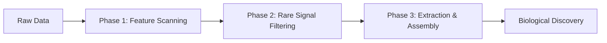

# PlatyGeno 🧬
**Unsupervised Gene Discovery via Evo 2 & Sparse Autoencoders**

[](https://pypi.org/project/platygeno/)
[](https://opensource.org/licenses/Apache-2.0)

PlatyGeno is a professional Python package designed to interpret the **Evo 2 genomic foundation model**. It bridges the gap between AI interpretability and biological discovery by identifying functional genomic motifs (promoters, enhancers, coding sequences) directly from raw sequence data without requiring labels.

---

## 🔭 Scientific Philosophy: Finding "Rare Needles"

Most bioinformatics tools are designed to find what we already know. PlatyGeno is built to find the **Dark Matter** of the genome.

*   **Beyond Database Search**: Traditional tools (like BLAST) find genes by matching them to known sequences. If a gene is entirely novel, BLAST will fail.
*   **Digital Subtraction**: PlatyGeno uses **Sparse Autoencoders (SAEs)** to identify "concepts" the AI has learned. By filtering out "Common Signals" (housekeeping genes like 16S RNA), we perform digital subtraction of known biology.
*   **Rare Needles**: We focus specifically on **Rare Features**—signals that fire strongly but only in a few reads. This is where novel antibiotic resistance, exotic enzymes, and viral signatures are most often found.
*   **Scale-Aware Discovery**: PlatyGeno automatically adapts its rarity filters based on dataset size. By using **Relative Frequency (0.1%)** instead of fixed counts, the engine remains just as effective at finding "One-in-a-million" outliers as it is at finding pilot-scale signals.

---

## 🏗️ Simplified Architecture

PlatyGeno layers a "De-coding" layer on top of the Evo 2 foundation model:

1.  **Evo 2 (The Brain)**: A 7-billion parameter model that has "read" the entire genomic history of Earth. It understands the grammar of DNA.
2.  **Sparse Autoencoders (The Interpreter)**: We use 32,768 "interpreters" (nodes) that translate Evo 2's complex internal math into distinct biological concepts.
3.  **Discovery Pipeline**: We scan raw FASTQ data through this stack, identifies where specific "interpreters" fire with high intensity, and assemble those signals into precise genomic hits.

---

## 🔬 Clinical Discovery Benchmark

PlatyGeno includes a professional, PhD-grade benchmarking pipeline designed for clinical metagenome samples (e.g., from the **IBDMDB**). To replicate our high-resolution discovery run (**Top 100 Features**), use the standardized **4-Step Ph.D. Workflow**:

1. **GPU Discovery**: `python validation/step1_discovery.py` — High-speed GPU feature scanning.
2. **Novelty Check**: `python validation/step2_local_blast.py` — identifies `potential_novel_sequences.csv`.
3. **FASTA Prep**: `python validation/step3_fasta_prep.py` — Translates novel DNA for AlphaFold.
4. **Gold Standard**: `python validation/step4_alphafold_run.py` — High-precision folding on RunPod.

---

## ⚙️ Hardware Requirements

PlatyGeno is optimized for high-performance genomic research:

> [!IMPORTANT]
> **GPU Mandatory**: An NVIDIA CUDA-enabled GPU (RTX 3090, 4090, A100, or H100) is required for inference.
> **VRAM**: We recommend **24GB VRAM** for the best experience.

*   **Primary Model**: By default, PlatyGeno utilizes the **Evo 2 7B** model. This provides the ideal balance between biological accuracy and memory efficiency for large-scale discovery.

---

## 🚀 Quick Start

The easiest way to use PlatyGeno is via PyPI. Ensure you are on a GPU-enabled instance (A100/H100/RTX 4090).

```bash
# 1. Install PlatyGeno
pip install platygeno

# 2. Install high-performance GPU kernels
pip install flash-attn --no-build-isolation

# 3. Install the package in editable mode
pip install -e .

# 4. Verify Discovery
platygeno --input sample.fastq --threshold 10.0
```

---

## 📦 Usage Modes

### 1. Command Line Interface (CLI)
Perfect for rapid discovery projects without writing any Python code.

```bash
# Basic discovery (uses default threshold 5.0)
platygeno --input data.fastq

# High-precision scan on a specific sequence range
platygeno --input data.fastq --threshold 12.0 --start 0 --end 5000 --output hits.csv
```

### 2. Library Mode (Python API)
Integrate discovery logic into your own bioinformatics pipelines.

```python
import platygeno

# Single-line discovery pipeline
df = platygeno.discover_genes(
    input_path="sample.fastq",
    scan_end=1000,
    min_activation=8.0
)

# Access precision snippets and assembled contigs
print(df[['method', 'activation', 'sequence']].head())
```

---

## 🧩 The Discovery Workflow

PlatyGeno moves from raw data to biological insight in three distinct scientific phases:



1.  **Phase 1: Feature Scanning**: Streams raw DNA through Evo 2. We record the "firing" of 32,768 SAE nodes for every base pair.
2.  **Phase 2: Rare Signal Filtering**: We filter for "Rare Needles"—signals that fire strongly but only in a few reads. This automatically skips common genomic "noise."
3.  **Phase 3: Extraction & Assembly**: We isolate the precise DNA snippets where the AI signal peaks and merge overlapping reads into longer, functional contigs ready for AlphaFold.

---

## 🏗 Package Anatomy

| Module | Purpose | Key Function |
| :--- | :--- | :--- |
| **`workflow.py`** | **Master Pipeline** | `discover_genes()` — High-level entry point. |
| **`core.py`** | **Model Engine** | `PlatyGenoEngine` — Manages Evo 2 & SAE states. |
| **`mapper.py`** | **Bioinformatics** | `assemble_feature_consensus()` — Greedy assembly. |
| **`evo_reader.py`** | **Data Loading** | `read_evo_features()` — Memory-efficient streaming. |

---

## ⚙️ Tuning the Discovery Engine: Finding the "Sweet Spot"

PlatyGeno uses three primary "dials" to separate genomic dark matter from housekeeping noise. Balancing these is the key to successful discovery:

### 1. Signal Strength (`min_activation`)
*   **What it is**: The intensity of the AI's "excitement" about a sequence.
*   **The Sweet Spot**: 
    *   **5.0 – 8.0**: "Surgical Sensitivity." Ideal for finding rare variants of known functional domains.
    *   **10.0+**: "Hardcore Novelty." Targets extreme outliers that the model identifies with high confidence.

### 2. Population Rarity (`rel_freq_max`)
*   **What it is**: The scale-aware filter that defines what is "Rare."
*   **The Sweet Spot**: 
    *   **0.1% (`0.001`)**: Broad net. Good for pilot runs on 20k–50k reads.
    *   **0.01% (`0.0001`)**: Deep mining. Essential for large datasets to skip "Common Junk."

### 3. Discovery Budget (`top_pct` / `top_n`)
*   **What it is**: Limits the number of results to prevent BLAST bottlenecks.
*   **The Sweet Spot**:
    *   **`top_n=10`**: Quick validation.
    *   **`top_pct=0.01`**: Recommended for large datasets. Automatically targets the most intense 1% of your outliers.

> [!TIP]
> If your discovery run returns **0 hits**, lower the `min_activation` to 5.0. 
> If it returns **too many knowns** (100% BLAST identity), decrease the `rel_freq_max` to 0.05% or 0.01%.

---

## 📊 Understanding Results

Results are saved as a CSV with the following columns:

*   **`method`**: `Best Snippet` (high precision) or `Assembled Contig` (high context).
*   **`feature_id`**: The SAE index (the AI's internal concept of the biological signal).
*   **`activation`**: The strength of the signal. Higher scores indicate stronger feature presence.
*   **`occurrence_count`**: The raw number of reads in your sample that contain this specific feature.
*   **`rarity_pct`**: The relative frequency of the feature (%) in the dataset (e.g., 0.04%).
*   **`sequence`**: The isolated DNA sequence ready for BLAST or downstream analysis.

---

## 🧪 From Snippet to Science: Downstream Applications

A 100bp "Novel" sequence is not the end of the road—it is the starting point for three high-impact research paths:

1.  **Structural Discovery (AlphaFold)**: We run novel snippets through **AlphaFold 2/3** (Step 4) to predict 3D domains. Even if DNA is novel, the 3D structure can reveal known enzymatic pockets or structural scaffolds.
2.  **Functional Interpretation (SAE Insights)**: By cross-referencing the `feature_id` with SAE interpretability catalogs, we can infer the biological "concept" the AI detected (e.g., "Manganese Binding" or "Halophilic Promoter").
3.  **Genomic Fishing**: Discovery hits serve as unique "Genetic Barcodes." Researchers can use these snippets as hooks to backtrack into the 1M+ read metagenome and assemble the **Full Gene** or **Genome** of the unknown organism.
4.  **Wet-Lab Synthesis**: The ultimate verification. These AI-discovered sequences can be synthesized and tested in vitro (e.g., cell-free expression) to verify novel biochemical functions.

---

## 📚 API Reference

### `platygeno.discover_genes()`
| Parameter | Type | Default | Description |
| :--- | :--- | :--- | :--- |
| `input_path` | `str` | *Req* | Path to the `.fasta`/`.fastq` file. |
| `scan_start` | `int` | `0` | First read index to scan. |
| `scan_end` | `int` | `4000` | Last read index to scan. |
| `min_activation` | `float` | `5.0` | Minimum activation strength. |
| `rel_freq_max` | `float` | `0.001` | Rarity limit (e.g., 0.001 = 0.1%). |
| `top_n` | `int` | `10` | Fixed number of rare features to target. |
| `top_pct` | `float` | `None` | Top % of candidate features to select (e.g. 0.05). |
| `output_path` | `str` | `None` | Path to save CSV results. |

---

## 📜 Primary References

If you use **PlatyGeno** in your research, please cite this package along with the foundational works it is built upon:

**1. PlatyGeno (This Package):**
```bibtex
@software{PlatyGeno2026,
  author = {Khoa Tu Tran},
  title = {PlatyGeno: Unsupervised Gene Discovery via Evo 2 & Sparse Autoencoders},
  url = {https://github.com/khoatran1995/PlatyGeno},
  year = {2026}
}
```

**2. Evo 2 (Foundation Model):**
> Arc Institute. (2026). **Genome modeling and design across all domains of life with Evo 2**. *Nature*. [DOI: 10.1038/s41586-026-10176-5]

**3. Evo 2 Interpretability & SAEs:**
> Deng, M., et al. (2025). **Interpreting Evo 2: Arc Institute's Next-Generation Genomic Foundation Model**. *Goodfire Research*. [DOI: 10.5281/zenodo.14895891]

---

## Acknowledgements
Developed by **[Khoa Tu Tran](https://github.com/khoatran1995)**. This project leverages the **[Evo 2](https://github.com/arcinstitute/evo2)** model by the **[Arc Institute](https://arcinstitute.org)** and Sparse Autoencoder architectures by **[Goodfire](https://goodfire.ai)**.

### 📊 Dataset Credits
The clinical benchmarking data used in this project is a subsample of **HSMA33OT_R1** from **The Inflammatory Bowel Disease Multi'omics Database (IBDMDB)**. We thank the IBDMDB investigators for making this high-impact clinical data publicly available for research.
*   **Source**: [ibdmdb.org](https://ibdmdb.org/)
