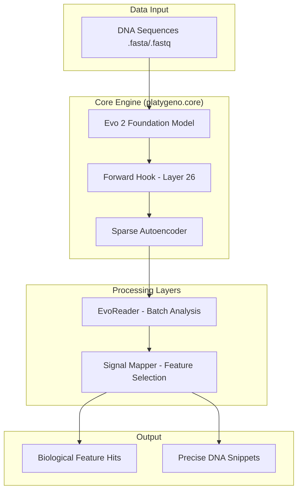

# PlatyGeno Master File 🧬

This document serves as the primary technical reference and architectural map for the **PlatyGeno** project. It outlines the design principles, implementation details, and biological logic used to interpret the Evo 2 genomic foundation model.

## 🏗 Project Architecture

PlatyGeno follows a modular design, separating model interaction from data processing and statistical analysis.

---

## 🧩 Module breakdown

### 1. `core.py`: The Engine
*   **Purpose**: Manages model loading and hidden state extraction.
*   **Key Logic**:
    *   Uses `torch.forward_hook` on `model.blocks[25]` (Layer 26).
    *   Extracted states are passed through a **Top-K Sparse Autoencoder** (Expansion 8, K=64).
    *   **Math**: Features are extracted via `sparse_features = relu((x - b_dec) @ W_enc + b_enc)` followed by a Top-K mask.

### 2. `evo_reader.py`: The Data Interface
*   **Purpose**: Efficiently streams genomic files into the engine.
*   **Key Logic**:
    *   Uses `Bio.SeqIO` with `islice` to prevent OOM on large FASTQ files.
    *   Converts continuous model activations into a "Discovery Report" (Pandas DataFrame).

### 3. `mapper.py`: Statistical Analysis
*   **Purpose**: Filters noise and isolates biological signals.
*   **Key Logic**:
    *   **Rare Needle Filter**: Identifies features with low frequency but high activation strength.
    *   **Token-Aware Scan**: Re-runs the model on winning sequences to find the exact base-pair responsible for activation.

### 4. `analyzer.py`: Utility
*   **Purpose**: Provides high-level entry points for sequence-to-feature conversion.

---

## 📝 Technical Notes for Development

### 1. Forward Hook Safety
Always ensure hooks are registered properly. In `core.py`, the hook captures the output of the transformer block.
> [!IMPORTANT]
> Use `.model.eval()` to avoid issues with specialized layers in Evo 2 (like Mamba/Attention wrappers).

### 2. Memory Management
*   Evo 2 7B is heavy. Ensure `torch.no_grad()` is used during inference.
*   `extracted_data` in `PlatyGenoEngine` should be detached (`.detach()`) to prevent GPU memory leaks from the computation graph.

### 3. Data Consistency (⚠️ Current TO-DOs)
There are currently naming inconsistencies that need fixing:
*   Standardize column names: Use `activation` across both `evo_reader` and `mapper`.
*   Standardize API: Update `analyzer.py` to use `get_features` instead of `process`.

### 4. Weights & Dependencies
*   **Evo 2**: Requires `evo2` package.
*   **SAE**: Weights are pulled from `Goodfire/Evo-2-Layer-26-Mixed` on Hugging Face.

---

## 🧬 Biological Context
The target is **Layer 26**. Research suggests this layer in Evo 2 is rich in functional biological motifs (promoters, enhancers, coding regions). The sparse features discovered here represent "disentangled" biological concepts that the model has learned during pre-training.
